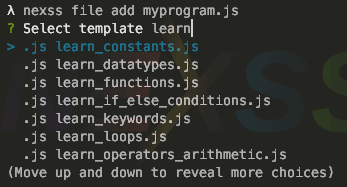

# NodeJS for Nexss Programmer 2.0

To Install Nexss Programmer please go to [Nexss Programmer CLI](https://github.com/nexssp/cli#readme) for more information.

## Templates

Each language in the Nexss Programmer has predefined templates which can be used easy by adding file `nexss file add myprogram.js` then the templates is displayed. You can search the template list just by typing after add file command.



## Tutorials

### Learn Any Programming Language Templates

Enter command 'nexss file add myfile.js'
and type learn for finding templates which starts with 'learn' keyword. [Picture above]

### Carlo Nexss Programmer Template

['Carlo' Repository](https://github.com/GoogleChromeLabs/carlo)  
[Carlo Api](https://github.com/GoogleChromeLabs/carlo/blob/master/API.md)

#### How to start Carlo with nexss programmer

```sh
nexss p new myp # we create new nexss project
cd myp
nexss file add mycarlo.js # add new carlo app
nexss start # This will show the carlo window
```
